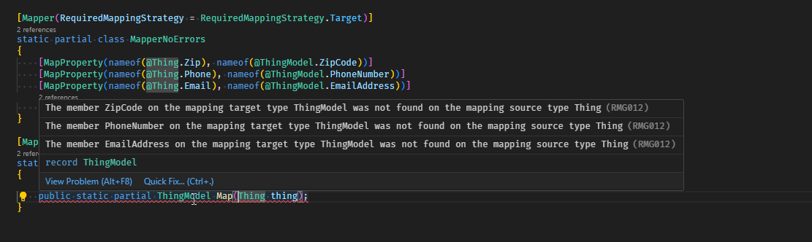
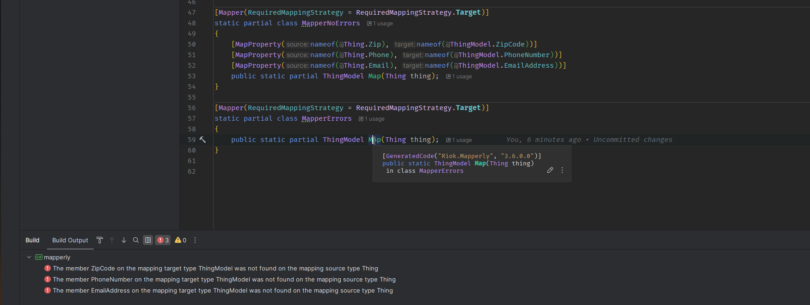

This is a simple repro for the issue described in .

## Steps to reproduce

1. .editorconfig must contain the diagnostic severity settings for RMG012 and RMG020:
    ```editorconfig
   [*.cs]
   dotnet_diagnostic.RMG012.severity = error # Unmapped target member
   dotnet_diagnostic.RMG020.severity = error # Unmapped source member
   ```
2. Restore and build the project.

## Expected behavior

In visual studio code, you will see the errors like so:



## Actual behavior

In rider, you will not see the errors.  However you will see the errors when you build.

